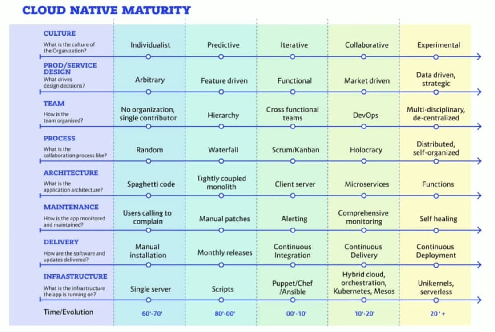

A (WIP) list of values, principles I would like to work by, as well as links to my references. Inspired by Allen Holub's [Heuristics for Effective Software Development](https://holub.com/heuristics-for-effective-software-development-a-continuously-evolving-list/)

## Product Management
- Escaping the build trap: [video](https://www.youtube.com/watch?v=DmJXpI7OJuY), [book](https://www.goodreads.com/book/show/42611483-escaping-the-build-trap)
- Outcomes over output: [book](https://www.goodreads.com/book/show/45186993-outcomes-over-output)
- Accelerate: [book](https://itrevolution.com/book/accelerate/), DevOps and the culture that it entails produces better results and correlates with bussiness success.
- Westrum's [typology of organizational cultures](https://www.researchgate.net/profile/Ron-Westrum-2/publication/8150380_A_Typology_of_Organisational_Cultures/links/0046351f7f516cb1a4000000/A-Typology-of-Organisational-Cultures.pdf): aim for a generative culture.
- Shreyas Doshi [Popular Threads on PM](https://twitter.com/shreyas/status/1303150374124048386).
- [Lean Product Management](https://railsware.com/blog/what-makes-product-development-lean/). Seven principles:
  - Eliminate waste
  - Build quality into the product
  - Amplify learning
  - Defer commitment
  - Deliver fast
  - Respect people
  - Optimize the whole 
- Legacy SW migration: [Patterns of Legacy Displacement](https://martinfowler.com/articles/patterns-legacy-displacement/)
- Outcome-based roadmaps: [article](https://medium.com/swlh/outcome-based-roadmaps-unleash-the-power-of-a-shared-vision-and-purpose-851401c7aa54), [presentation](https://drive.google.com/file/d/1LXCxfQbGeBlJXUtm-3mtLIR-NWQYgNFh/view?usp=sharing)
- Company maturity for Cloud (taken from the [Outcome-based roadmaps presentation](https://drive.google.com/file/d/1LXCxfQbGeBlJXUtm-3mtLIR-NWQYgNFh/view?usp=sharing)):

## Teams and Peopleware
- [Value] *Psychological Safety* is needed for a successful team/company
- [Value] *Respect* at all levels 
- [Value] *Trust*: we need to activelly put our trust in people to do what they have been hired to do and help them grow
- [Value] *Learning* is one of the most important duties of the individual and the organization. It is necessary for people to have time to learn. The organization needs time to learn.
- [Value] *Experimentation*. Thinking in bets. Encourage experimentation (risk management again): assign the time/money for the experiment and evaluate results. Stay [concave](https://www.goodreads.com/book/show/13530973-antifragile): many little investments that will probably fail can (and eventually will) be offset by one that will be very successful.

- Blame culture is toxic and prevents progress (see _Psychological safety_). Everyone needs to assume their share of the responsibility when results are not the expected ones.
- Do not aim to never fail, aim at recovering quickly from failures and LEARN in the process. Understand that nobody wants to fail, specially when they feel part of the team, the project and the strategic objectives. Manage risk, not people.
- Communication is key: non-violent open communication is one of most important elements of team success.

## Software Development
- The [Agile Manifesto](https://agilemanifesto.org/) is still valid today:
  - Individuals and interactions over processes and tools Working software over comprehensive documentation
  - Customer collaboration over contract negotiation
  - Responding to change over following a plan

- Estimations are counter-productive, they are taken as promises by the client when they can *never* be right
- Trying to make better estimates is a fool's errand, which will take up time that could be used for doing something actually useful (something that actually brings you closer to an actual outcome)
- [allenholub] (https://twitter.com/allenholub): "The presence of a bug is actually the absence of a test"
- Code Style: program in algorithms ([No RAW loops!](https://www.youtube.com/watch?v=W2tWOdzgXHA))
- Coding is a **social activity**: pair programming and [mob programming](https://mobprogramming.org/mob-programming-basics/) produce superior software with lower costs.
- Remove crust: [refactor and simplify](https://martinfowler.com/articles/is-quality-worth-cost.html) or the monster will eat you (and your profit).
- Why the Waterfall model is flawed [waterfall model probably the most costly mistake in the world](http://valueatwork.se/waterfall-model-probably-the-most-costly-mistake-in-the-world/?lang=en).
- Mob Programming [resources](https://trello.com/b/1lfMkCOh/software-profession-resources).
- Mob Programming: it is about [being more effective by enabling **flow** and reducing **waste**](https://www.youtube.com/watch?v=28S4CVkYhWA).
- [Gotta be Good (Ron Jeffries)](https://ronjeffries.com/articles/-z022/0222ff/gotta-be-good/):

> What we have to do:
> To thrive in the iterative incremental world, we need to accomplish some difficult things:
> 
> We need to evolve the design from simple to more and more capable;
> We need to test all the software all the time, because the design is changing and that can break things;
> We need to add capability in tiny tiny slices, because you really can’t do a big feature in a week or two;
> We need to build the system many times a week, many times a day, to be sure that we can be shippable at the end of every week;
> I’m sure I could make the list more detailed, but those items make it hard enough.

## [Extra] Elon Musk 5 step process:

  1. Make your requirements less dumb
    - Question the requirements (specially if they came from a very smart person)
    - Make individuals responsible for keeping a requirement (not departments)

  2. Try very hard to delete the part or the process
    - If you are not adding things back in 10% of the time, you are not deleting enough
    - There is a bias for adding parts/processes/steps in a process 'in case we need it'

  3. Simplify or optimize
    - Convergent thinking: in school/college we are trained to answer the question, not to question the problem itself
    - You may be optimizing a thing that should not exist in the first place

  4. Accelerate cycle time
    - You are slow: you can iterate faster
    - But not until you have gone through the first three steps: digging faster is great unless you are actually digging your own grave. Work faster on what is important.

  5. Automate
    - Once the problem is nailed down, find the way to automate it
    - Reduce cycle time by automating and removing unnecessary steps in the workflow

## Examples

- Company values: [GitLab](https://about.gitlab.com/handbook/values/)